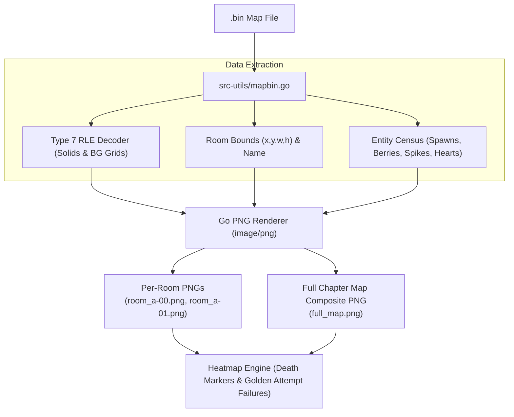

# Implementation Plan: `.bin` Map Rendering (Per-Room & Full-Map Composite PNGs + Heatmap Layer)

## Goal & Architecture Overview

Using the BinaryPacker specification from `CelesteMapBin_Format.md` and the real-world mod patterns from `CelesteMapBin_Quirks_And_ModPatterns.md`, this plan details the end-to-end pipeline to:
1. Parse `.bin` maps in Go (`src-utils/mapbin.go`).
2. Decode room metadata, Type 7 RLE tile data (`solids`, `bg`), entity locations (strawberries, hearts, spawns, hazards), decals, and `Filler` rectangles.
3. Render **per-room PNG images** (`room_<name>.png`).
4. Assemble a **full composite chapter map PNG** (`full_map.png`) using room global coordinates `(x, y)`.
5. Support a **Heatmap / Death Mark Overlay Layer** for plotting room deaths and golden attempt failure locations.

---

## Detailed Data Extraction Specification

### 1. Room Level Element & Attributes
In BinaryPacker, each room is a `level` element under `Map -> levels`:
- `name` (string): Room identifier (e.g. `a-00`, `lvl_start`).
- `x` (int), `y` (int): Top-left room position in global map pixels.
- `width` (int), `height` (int): Room dimensions in pixels (default room: 320x180 px = 40x22 tiles).

### 2. Type 7 RLE Tile String Decoding (`solids` & `bg`)
Tile data in `solids` and `bg` elements uses **Attribute Type 7** (Run-Length Encoded string):
- **Header**: `uint16` byte length of encoded pairs.
- **Payload**: Sequence of `(count uint8, char uint8)` byte pairs.
- **Decoding**: Expanding `count` repetitions of `char` produces lines separated by `\n` forming a grid of `(width / 8)` columns by `(height / 8)` rows.
  - `'0'` / `' '` = Air (empty tile).
  - `'1'`, `'2'`, `'3'`, `'a'`, `'b'`, etc. = Foreground/Background tile material ID.

### 3. Entities & Hazards
Under `level -> entities`:
- `name` (string): Entity type (e.g. `strawberry`, `spikesUp`, `spring`, `refill`, `player`, `blackGem`, `checkpoint`).
- `x` (float/int), `y` (float/int): Entity position relative to room origin.
- `width` (int), `height` (int): Entity bounding box.

### 4. Full-Map Bounding Box & Composite Assembly
Across all rooms in a map:
$$\text{minX} = \min(\text{room.X}), \quad \text{minY} = \min(\text{room.Y})$$
$$\text{maxX} = \max(\text{room.X} + \text{room.Width}), \quad \text{maxY} = \max(\text{room.Y} + \text{room.Height})$$
- Full Map Image dimensions: $(\text{maxX} - \text{minX}) \times (\text{maxY} - \text{minY})$.
- Each room is composite-drawn onto the full map image at offset:
  $$\text{offsetX} = \text{room.X} - \text{minX}, \quad \text{offsetY} = \text{room.Y} - \text{minY}$$

---

## Pipeline Flow



---

## Proposed Code Changes

### [Component: Native Binary Packer Parser & PNG Exporter]

#### [MODIFY] `src-utils/mapbin.go`
- Implement Type 7 RLE decoder `decodeRLEString(data []byte) (string, error)`.
- Implement `readFullMapData(data []byte) (*MapDataPayload, error)` to parse levels, tiles, entities, and room bounds.
- Implement `renderRoomToImage(room *RoomData) *image.RGBA`:
  - Renders background grid (dark neutral `#18181c` or translucent tile colors).
  - Renders solids tiles (`#4a5568` slate or material palette).
  - Renders hazard/entity markers:
    - Spikes: Red indicator lines along tile edges.
    - Strawberries: Red/Golden/Moon berry icons.
    - Hearts: Cyan/Crystal heart icons.
    - Player spawn: Green start marker.
- Implement `renderFullMapComposite(mapData *MapDataPayload) *image.RGBA`:
  - Allocates full composite image canvas.
  - Draws room backgrounds, tiles, and room border outlines.
- Add CLI subcommand `export-map-images --mod <path> --map <sid> --out <dir>` producing:
  - `manifest.json`: List of rooms, `x`, `y`, `width`, `height`, relative PNG paths.
  - `rooms/room_<name>.png` for every room.
  - `full_map.png` composite map image.

---

### [Component: TypeScript Go Bridge & Heatmap Overlay]

#### [MODIFY] `src-utils/Zip_Go.ts`
- Add TypeScript wrapper methods:
  - `Zip_Go.exportMapImages(opts: { modPath: string, mapSid: string, outputDir: string }): Promise<ExportMapImagesResult>`
  - `Zip_Go.getMapRoomsManifest(opts: { modPath: string, mapSid: string }): Promise<MapRoomsManifest>`

#### [NEW] `src/libs/MapRenderer/HeatmapOverlay.ts`
- Pure TypeScript HTML5 Canvas heatmap rendering helper:
  - `DrawRoomDeathHeatmap(ctx: CanvasRenderingContext2D, deaths: Array<{ x: number, y: number, count: number }>, opts?: { radius?: number })`
  - `DrawGoldenAttemptDeaths(ctx: CanvasRenderingContext2D, failures: Array<{ roomName: string, x: number, y: number, attemptNumber: number }>)`

---

## Verification Plan

### Automated Tests
```bash
1. bun test testing/go-utils-tests/Zip_Go_CountCollectibles.test.ts
2. bun test testing/go-utils-tests/Zip_Go_ExportMapImages.test.ts    # [NEW] Verify map parsing & PNG generation
3. bun run check                                                        # svelte-check & tsc verification
4. bun run lint:fix                                                    # Biome lint check
```

### Manual Verification
1. Test command execution on vanilla `Content/Maps/1-ForsakenCity.bin` and custom mod `.bin` maps.
2. Check `rooms/room_a-00.png` and `full_map.png` for correct tile dimensions, room relative positioning, and entity markers.
3. Validate room manifest JSON coordinates match database room records.
# Implementation Plan: `.bin` Map Rendering (Per-Room & Full-Map Composite PNGs + Heatmap Layer)

## Goal & Architecture Overview

Using the BinaryPacker specification from `CelesteMapBin_Format.md` and the real-world mod patterns from `CelesteMapBin_Quirks_And_ModPatterns.md`, this plan details the end-to-end pipeline to:
1. Parse `.bin` maps in Go (`src-utils/mapbin.go`).
2. Decode room metadata, Type 7 RLE tile data (`solids`, `bg`), entity locations (strawberries, hearts, spawns, hazards), decals, and `Filler` rectangles.
3. Render **per-room PNG images** (`room_<name>.png`).
4. Assemble a **full composite chapter map PNG** (`full_map.png`) using room global coordinates `(x, y)`.
5. Support a **Heatmap / Death Mark Overlay Layer** for plotting room deaths and golden attempt failure locations.

---

## Detailed Data Extraction Specification

### 1. Room Level Element & Attributes
In BinaryPacker, each room is a `level` element under `Map -> levels`:
- `name` (string): Room identifier (e.g. `a-00`, `lvl_start`).
- `x` (int), `y` (int): Top-left room position in global map pixels.
- `width` (int), `height` (int): Room dimensions in pixels (default room: 320x180 px = 40x22 tiles).

### 2. Type 7 RLE Tile String Decoding (`solids` & `bg`)
Tile data in `solids` and `bg` elements uses **Attribute Type 7** (Run-Length Encoded string):
- **Header**: `uint16` byte length of encoded pairs.
- **Payload**: Sequence of `(count uint8, char uint8)` byte pairs.
- **Decoding**: Expanding `count` repetitions of `char` produces lines separated by `\n` forming a grid of `(width / 8)` columns by `(height / 8)` rows.
  - `'0'` / `' '` = Air (empty tile).
  - `'1'`, `'2'`, `'3'`, `'a'`, `'b'`, etc. = Foreground/Background tile material ID.

### 3. Entities & Hazards
Under `level -> entities`:
- `name` (string): Entity type (e.g. `strawberry`, `spikesUp`, `spring`, `refill`, `player`, `blackGem`, `checkpoint`).
- `x` (float/int), `y` (float/int): Entity position relative to room origin.
- `width` (int), `height` (int): Entity bounding box.

### 4. Full-Map Bounding Box & Composite Assembly
Across all rooms in a map:
$$\text{minX} = \min(\text{room.X}), \quad \text{minY} = \min(\text{room.Y})$$
$$\text{maxX} = \max(\text{room.X} + \text{room.Width}), \quad \text{maxY} = \max(\text{room.Y} + \text{room.Height})$$
- Full Map Image dimensions: $(\text{maxX} - \text{minX}) \times (\text{maxY} - \text{minY})$.
- Each room is composite-drawn onto the full map image at offset:
  $$\text{offsetX} = \text{room.X} - \text{minX}, \quad \text{offsetY} = \text{room.Y} - \text{minY}$$

---

## Pipeline Flow


---

## Proposed Code Changes

### [Component: Native Binary Packer Parser & PNG Exporter]

#### [MODIFY] `src-utils/mapbin.go`
- Implement Type 7 RLE decoder `decodeRLEString(data []byte) (string, error)`.
- Implement `readFullMapData(data []byte) (*MapDataPayload, error)` to parse levels, tiles, entities, and room bounds.
- Implement `renderRoomToImage(room *RoomData) *image.RGBA`:
  - Renders background grid (dark neutral `#18181c` or translucent tile colors).
  - Renders solids tiles (`#4a5568` slate or material palette).
  - Renders hazard/entity markers:
    - Spikes: Red indicator lines along tile edges.
    - Strawberries: Red/Golden/Moon berry icons.
    - Hearts: Cyan/Crystal heart icons.
    - Player spawn: Green start marker.
- Implement `renderFullMapComposite(mapData *MapDataPayload) *image.RGBA`:
  - Allocates full composite image canvas.
  - Draws room backgrounds, tiles, and room border outlines.
- Add CLI subcommand `export-map-images --mod <path> --map <sid> --out <dir>` producing:
  - `manifest.json`: List of rooms, `x`, `y`, `width`, `height`, relative PNG paths.
  - `rooms/room_<name>.png` for every room.
  - `full_map.png` composite map image.

---

### [Component: TypeScript Go Bridge & Heatmap Overlay]

#### [MODIFY] `src-utils/Zip_Go.ts`
- Add TypeScript wrapper methods:
  - `Zip_Go.exportMapImages(opts: { modPath: string, mapSid: string, outputDir: string }): Promise<ExportMapImagesResult>`
  - `Zip_Go.getMapRoomsManifest(opts: { modPath: string, mapSid: string }): Promise<MapRoomsManifest>`

#### [NEW] `src/libs/MapRenderer/HeatmapOverlay.ts`
- Pure TypeScript HTML5 Canvas heatmap rendering helper:
  - `DrawRoomDeathHeatmap(ctx: CanvasRenderingContext2D, deaths: Array<{ x: number, y: number, count: number }>, opts?: { radius?: number })`
  - `DrawGoldenAttemptDeaths(ctx: CanvasRenderingContext2D, failures: Array<{ roomName: string, x: number, y: number, attemptNumber: number }>)`

---

## Verification Plan

### Automated Tests
```bash
1. bun test testing/go-utils-tests/Zip_Go_CountCollectibles.test.ts
2. bun test testing/go-utils-tests/Zip_Go_ExportMapImages.test.ts    # [NEW] Verify map parsing & PNG generation
3. bun run check                                                        # svelte-check & tsc verification
4. bun run lint:fix                                                    # Biome lint check
```

### Manual Verification
1. Test command execution on vanilla `Content/Maps/1-ForsakenCity.bin` and custom mod `.bin` maps.
2. Check `rooms/room_a-00.png` and `full_map.png` for correct tile dimensions, room relative positioning, and entity markers.
3. Validate room manifest JSON coordinates match database room records.


Map .bin → PNG Rendering — Phase 1 (Blueprint MVP)
Context
CURRENTPLAN.md (checked into the repo root, untracked) proposes a full pipeline: parse .bin maps in Go, render per-room and full-map composite PNGs, plus a death heatmap overlay. Before executing it, we needed to check a load-bearing assumption: can tile chars, decals and stylegrounds be turned into real, pixel-accurate images right away?

Research (this session) found:

The project's own map-format docs (docs/TheCelesteDesktop/CelesteMapBin_Format.md, CelesteMapBin_Quirks_And_ModPatterns.md) only describe the BinaryPacker container (varint strings, lookup table, RLE type-7 strings) as used by the existing collectible counter (src-utils/mapbin.go). They say nothing about how a tile char maps to a texture, or how decal/styleground elements reference images.
That mapping is two more layers deep: (1) Everest's Content/Graphics/ForegroundTiles.xml / BackgroundTiles.xml (plain XML, defines per-tileset autotiling mask rules), and (2) the actual pixels, which for vanilla Celeste live in proprietary packed atlases (Content/Graphics/Atlases/Gameplay.meta + Gameplay0.data), not loose PNGs. No decoder for this format exists anywhere in this repo.
Decals and stylegrounds reference loose PNGs for mods (Graphics/Atlases/Gameplay/decals/..., .../bgs/...) but for vanilla they're packed the same way.
Given that, the user agreed to split this into two phases and asked me to plan Phase 1 only right now:

Phase 1 (this plan): Blueprint MVP. Follow CURRENTPLAN.md's original shape — flat-color tile fills, simple entity shape markers, room borders, full-map composite — with zero dependency on atlas decoding. This gets the whole .bin → PNG pipeline (Go parser, CLI subcommand, TS bridge, test) working end-to-end.
Phase 2 (future, not part of this plan): Asset-accurate rendering. Real tile pixels via a new atlas .data/.meta decoder (format is reverse-engineered/known from open-source tools such as Lönn, but undocumented in this repo) plus the ForegroundTiles.xml/BackgroundTiles.xml autotiling rule engine, and real decal/styleground images resolved across vanilla + mod override layers. Flagged here as a known follow-up, deliberately out of scope now.
Phase 1 Scope
Extend the existing map-bin reader rather than write a new one. src-utils/mapbin.go already has a working binReader (header/lookup table, varint strings, RLE type-7 decoding stub — currently just skips the RLE payload) used by countCollectiblesInMap. Reuse readHeader, u8/u16/varint/str/lookupAt, and the element-walking shape; add a second, fuller walk that actually materializes room/tile/entity data instead of only counting collectibles.

Data to extract (flat-color MVP — no texture lookups)
Rooms (level elements under Map -> levels): name, x, y, width, height attributes.
Tiles (solids, bg child elements of a room): decode the existing RLE type-7 payload (count/char byte pairs) into a width/8 x height/8 grid; '0'/' ' = air, anything else = filled. MVP only needs filled-vs-air, not per-material identity.
Entities (entities children, reusing the existing container-tracking logic): name, x, y, width, height. Bucket into a small fixed set of marker kinds for coloring: spawn/player, collectible (reuse countCollectiblesInMap's existing name-pattern classifier — no need to re-derive it), hazard (spike/spring-ish name patterns), everything else generic.
Decals and stylegrounds are parsed structurally but not rendered in Phase 1 (their element shape can be walked and counted/logged, but no image compositing) — call this out explicitly in code comments so Phase 2's scope is obvious at the point it's picked up.
[MODIFY] src-utils/mapbin.go
Add MapRenderData types (room list with tile grids + entities) and a readFullMapData(data []byte) (*MapRenderData, error) walk, structured like readElement/readAttributes but capturing values instead of discarding them.
Add renderRoomToImage(room *RoomData) *image.RGBA using Go's stdlib image/image/color/image/png only — flat fills: dark background, slate solids, colored entity-marker rects/dots. No external imaging dependency (stdlib is enough for flat rects).
Add renderFullMapComposite(rooms []*RoomData) *image.RGBA per the bounding-box math already specified in CURRENTPLAN.md (min/max over room x/y/width/height, offset each room by room.XY - min).
Add a ExportMapImages(modPath, mapSid, outDir string) (*ExportMapImagesResult, error) entry point mirroring CountCollectibles's zip-vs-folder dispatch (reuse isMapBinPath/sidFromMapPath and the zip/folder walking already in this file instead of duplicating it). Writes manifest.json (per-room name/x/y/width/height/relative PNG path) + rooms/room_<name>.png + full_map.png to outDir.
[MODIFY] src-utils/zip_main.go
Add an export-map-images cobra subcommand under the existing zip command group (same pattern as countCollectiblesCmd): flags --mod, --map (SID), --out; calls ExportMapImages, send()s the result JSON envelope.
[MODIFY] src-utils/Zip_Go.ts
Add exportMapImages(opts: { modPath: string; mapSid: string; outputDir: string }): Promise<ExportMapImagesResult> following the exact executeInternal<R>(...) + JSDoc pattern already used by countCollectibles in this file. Add matching ExportMapImagesResult/MapRoomManifestEntry interfaces next to the existing MapCollectiblesResult ones.
[NEW] testing/go-utils-tests/Zip_Go_ExportMapImages.test.ts
Mirror Zip_Go_CountCollectibles.test.ts: build a minimal fake .bin via the same hand-rolled BinaryPacker writer helper (extend it to also emit x/y/width/height int attributes and a solids RLE string, since the current helper only emits bool attributes), zip it, call exportMapImages, assert manifest.json room count/dimensions and that PNG files exist with expected pixel dimensions (width x height, scaled by whatever pixel-per-game-unit constant is chosen, e.g. 1:1 or downsampled if full maps get large).
Add a test.skipIf(!existsSync(REAL_CELESTE)) case against a real vanilla map (e.g. 1-ForsakenCity.bin) for a smoke check, matching the existing skip pattern for real-Celeste-dependent tests.
Explicitly Out of Scope (Phase 2 follow-up, not planned in detail here)
Atlas .data/.meta binary decoder.
ForegroundTiles.xml/BackgroundTiles.xml autotiling rule engine.
Real decal/styleground image compositing (position, scale, rotation, scroll/parallax, color).
The HeatmapOverlay.ts TS canvas layer from CURRENTPLAN.md — depends on death-location data sourcing that's a separate concern; can be revisited once Phase 1's PNGs exist to overlay onto.
Verification
bun test testing/go-utils-tests/Zip_Go_CountCollectibles.test.ts — confirm no regression to the shared mapbin.go reader.
bun test testing/go-utils-tests/Zip_Go_ExportMapImages.test.ts — new test, including the real-vanilla-map smoke case if Celeste is installed locally.
bun run check — svelte-check/tsc across the new Zip_Go.ts types.
bun run lint:fix then bun run check again.
Manual: run the new CLI subcommand against Content/Maps/1-ForsakenCity.bin (vanilla) and one installed mod map, open full_map.png and a couple of rooms/room_*.png to eyeball room placement/solid-tile silhouette/entity markers.