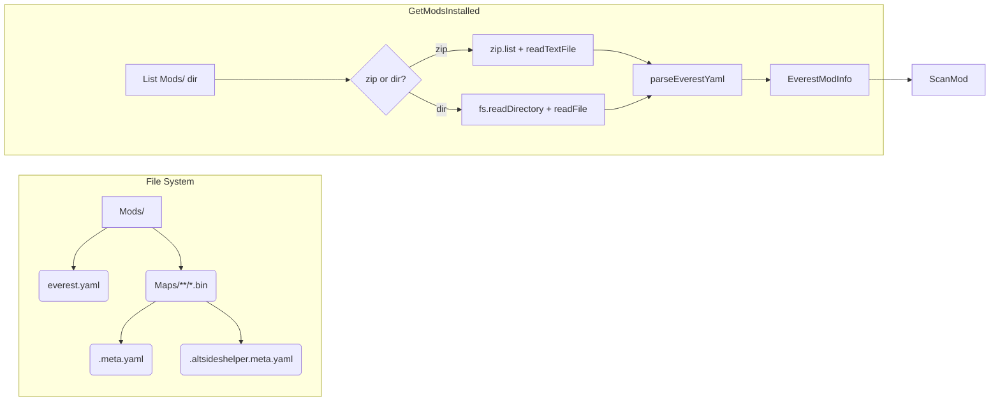
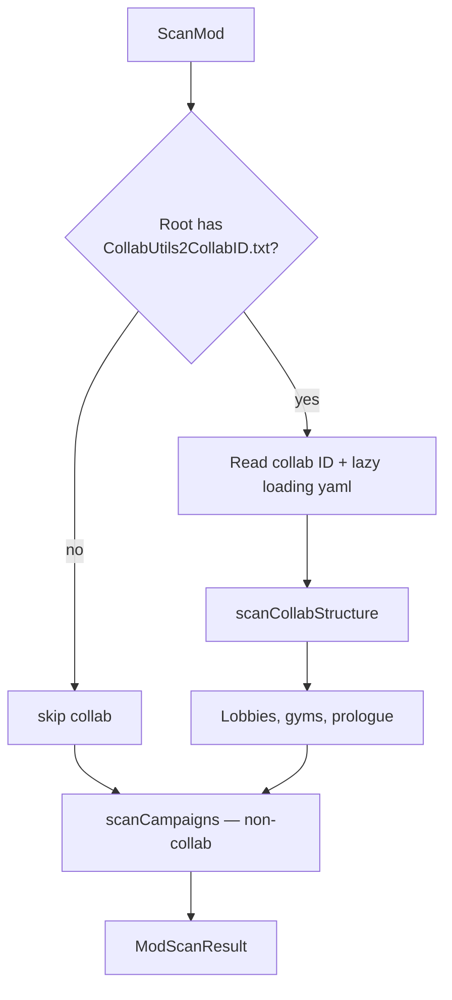
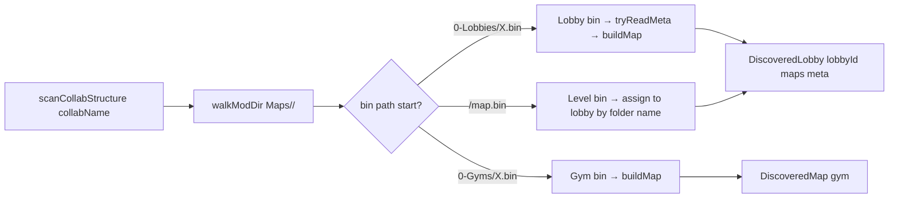
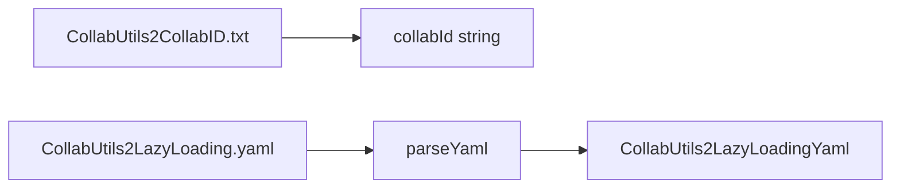

# Everest Parsing Flow

## 1. Everest Core Types & Scanning



### Discriminated Union — `ModMetadata`

```typescript
// lobby mod — has sub-lobbies with their own chapters
{ isLobby: true; lobbyChapters: LobbyChapter[] }

// standard mod — flat chapter list
{ isLobby: false; chapters: ModChapter[] }
```

### ScanMod — Branching



### Non-Collab Campaign Scan

```mermaid
flowchart LR
  N[scanCampaigns] --> O[scanBinFiles Maps/]
  O --> P[deriveSid per .bin]
  P --> Q{parts.length < 3?}
  Q -->|yes: Maps/A/Camp/Ch.bin| R[group by Author/Campaign]
  Q -->|no: skip| S[ignore]
  R --> T[buildMap — tryReadMeta .meta.yaml + .altsideshelper.meta.yaml]
  T --> U[DiscoveredCampaign[]]
```

Non-collab = `Maps/<Author>/<Campaign>/<Chapter>.bin` — flat, one level of folders.

### Collab Structure



Collab = `Maps/<CollabName>/<LobbyId>/<Map>.bin` — nested, each subfolder is a lobby.

### Dialog Names

Level and campaign names come from `Dialog/<Lang>.txt`:

```
Author_Campaign= My Campaign
Author_Campaign_MapName= My Map
```

Dialog ID = SID with `/` → `_`, `-` → `_`, spaces removed.

---

## 2. Collab Utils 2 Types



```typescript
// enable: bool
// excludedPrefixes?: { gui?: string[]; gameplay?: string[] }
```

### Lobby Map meta.yaml extras

```yaml
stickers:
  - path: SJ2021/1-Beginner/Asterisk
    finishedMaps: [StrawberryJam2021/1-Beginner/asteriskblue]
collabUtilsRandomizedFlags:
  flag1: 0.2
  flag2: 0.5
```

---

## 3. Alt Sides Helper Types

```mermaid
flowchart LR
  A[map.altsideshelper.meta.yaml] --> B[parseYaml]
  B --> C[AltSidesHelperMeta]
  C --> D{sides or altSideData?}
  D -->|sides| E[AltSideDef[]]
  D -->|altSideData| F[{ isAltSide, for }]
```

```typescript
// sides: array of side definitions (A-side customizations or alt-side references)
//   map?: string — SID of the alt-side map
//   preset?: 'a-side' | 'b-side' | 'c-side' | 'd-side' | 'none'
//   overrideVanillaSideData?: boolean
//   heartColour?, icon?, label?, unlockMode?, showBerriesAsGolden?, etc.
//
// altSideData: present on alt-side map meta
//   isAltSide: true
//   for: string — A-side SID this alt-side belongs to
//   copyEndScreenData?: boolean
//   copyTitle?: boolean
```

---

## SID Derivation

```
Maps/Author/Campaign/MyMap.bin
  → deriveSid → Author/Campaign/MyMap
  → baseSid   → Author/Campaign/MyMap  (A-side, unchanged)
  → detectMapSide → A

Maps/Author/Campaign/MyMap-B.bin
  → deriveSid → Author/Campaign/MyMap-B
  → baseSid   → Author/Campaign/MyMap  (-B stripped)
  → detectMapSide → B
```

---

## Reading Order

1. `GetModsInstalled()` — lists `Mods/`, finds `everest.yaml` in each entry, produces `EverestModInfo`
2. `ScanMod(info)` — per-mod entry point:
   - Detects `CollabUtils2CollabID.txt` → collab? read lazy-loading yaml, scan collab structure (lobbies/gyms)
   - Else scan as non-collab: `Maps/<Author>/<Campaign>/` → chapters grouped by campaign prefix
3. Each `.bin` gets sibling `.meta.yaml` and `.altsideshelper.meta.yaml` via `tryReadMeta<T>`
4. Dialog files scanned for campaign and level display names
5. Result: `ModScanResult` — campaigns + optional collab hierarchy
