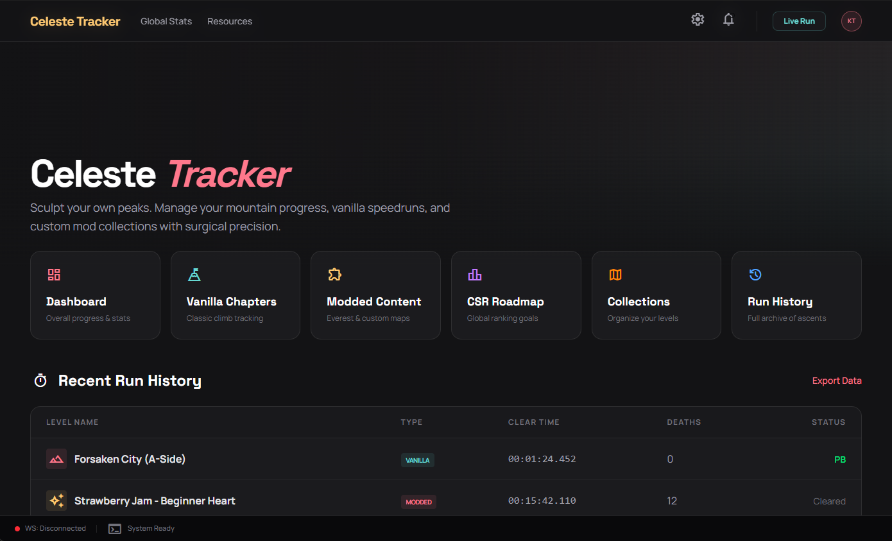

# TheCelesteTracker Desktop


A modern, high-performance desktop companion for **Celeste** gameplay tracking. Built with **Tauri**, **Rust**, and **SvelteKit**.


***Still under development***

## Features

- **Real-time Synchronization**: Automatically connects to the Celeste mod's WebSocket server.
- **Auto-Port Scanning**: Scans ports `50500` through `50600` to find your running instance.
- **Live Overlay**: Full-screen immersive mode triggered automatically when entering a level.
- **Strongly Typed Events**: Handles `LevelStart`, `Death`, `Dash`, and `AreaComplete` events with Rust-backed precision.
- **Zero-Flash Navigation**: Eager loading of layout properties for a seamless desktop experience.

## Tech Stack

- **Backend**: [Rust](https://www.rust-lang.org/) + [Tauri v2](https://v2.tauri.app/)
- **Frontend**: [SvelteKit](https://kit.svelte.dev/) + [Tailwind CSS](https://tailwindcss.com/)
- **Async Runtime**: [Tokio](https://tokio.rs/)
- **Communication**: [tokio-tungstenite](https://github.com/snapview/tokio-tungstenite) (WebSockets)

## Getting Started

### Prerequisites

- [Rust](https://www.rust-lang.org/tools/install)
- [Node.js](https://nodejs.org/) (v18+)
- [Bun](https://bun.sh/) (Recommended) or `npm`
- **Celeste Mod**: Ensure you have the corresponding Celeste Tracker mod installed in Everest.

### Installation

1. Clone the repository:
   ```bash
   git clone https://github.com/yourusername/TheCelesteTracker_Desktop.git
   cd TheCelesteTracker_Desktop
   ```

2. Install dependencies:
   ```bash
   bun install
   ```

3. Run in development mode:
   ```bash
   bun run tauri dev
   ```

## Architecture

- `src-tauri/src/ws.rs`: Manages the WebSocket connection lifecycle and port scanning.
- `src-tauri/src/events.rs`: Defines the strong types for Celeste gameplay events.
- `src/lib/types/celeste_state.svelte.ts`: Global reactive state for the frontend using Svelte 5 Runes.
- `src/routes/+layout.svelte`: Handles global event listeners and the Live Overlay UI.

## Screenshots and usage

## Main menú (Dashboard)


***Still under development, current GUI appearence subject to change***


One of many features incoming. Gets stats in real time as you play and (not yet implemented) store them internally for global stats, add runs for your modded maps, and visualize all your playtime.

Expected to add official support for **Celeste Skill Rating** maps and tracking!

## Why this project exists?
Normally the community organize all their achievements and stats using.... ***excel??***. 

Works well, but not the ideal environment. The community (and myself) deserve a better way to track all the undocumented progress you make in mod maps, lobbies, and the well-known 'Celeste Skill Rating' maps lists.

All in one place, lets stop feeding manually our excel sheets and start documenting all your celeste progress with automated tools!

## Contributing

Contributions are welcome! Please feel free to submit a Pull Request.

## License

This project is licensed under the MIT License - see the [LICENSE](LICENSE) file for details.

---
*Created for the Celeste community.*
