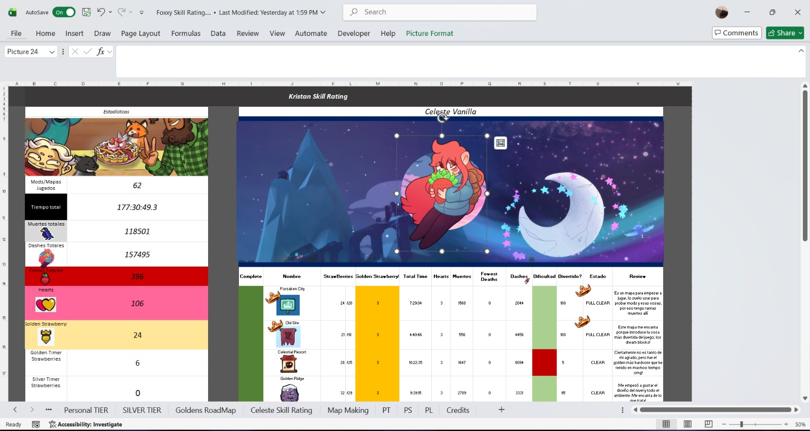
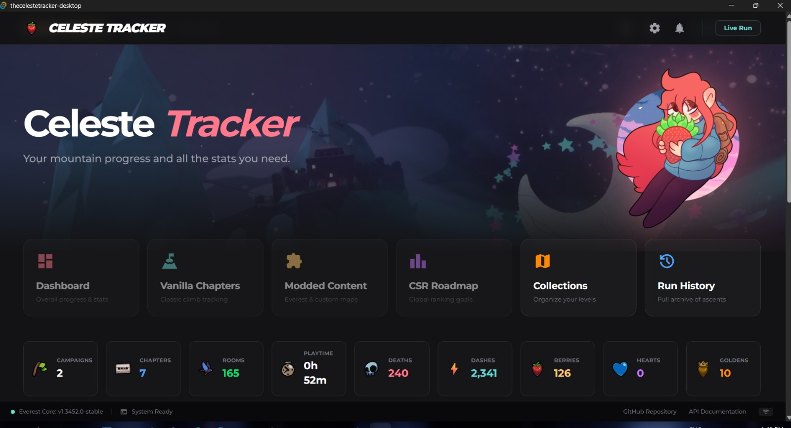
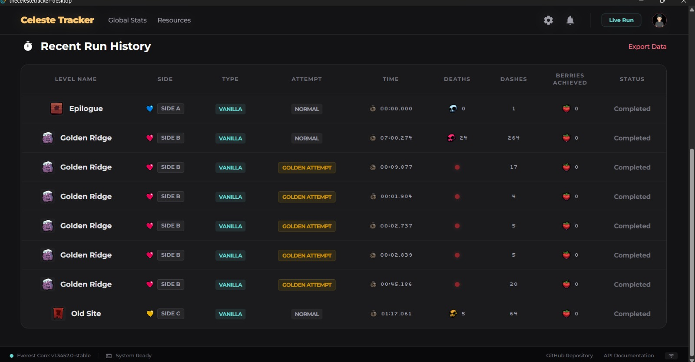

# TheCelesteTracker Desktop

<div align="center">
  

  ### **Stop tracking Celeste in Excel.**
  *Auto-track runs, deaths, and progress with zero manual effort.*

  [Features](#features) • [Tech Stack](#tech-stack) • [Getting Started](#getting-started) • [Architecture](#architecture)
</div>

---

**TheCelesteTracker** is a high-performance desktop companion for Celeste. It captures real-time gameplay data giving you instant insights without the manual data entry.

> ***Still under development, not ready for usage***

## Why this exists?
Celeste community uses **spreadsheets** for pretty much anything.  Achievements, map progress, lobby stats—all manual.
**No more.** TheCelesteTracker aims to automates the "Excel grind" so you can focus on the "Celeste grind."

<div align="center">
  <table style="width: 100%; border-collapse: collapse;">
    <tr>
      <th align="center">Manual Excel (The Past)</th>
      <th align="center">Auto Desktop App (The Future)</th>
    </tr>
    <tr>
      <td align="center">
        
        <p><sub><i>This is my real excel that I use to track my celeste modding progress and vanilla</i></sub></p>
      </td>
      <td align="center">
        
        <p><sub><i>Automating with dedicated app including support for "Celeste Skill Rating" discord maps (Future feature I want to implement)</i></sub></p>
      </td>
    </tr>
  </table>
</div>

Note: Ofc, there are mods to track this info, but theyi all in-game, limited by the interface and sometimes they have their own-learning-curve, making them kinda hard to use.

## Key Features

- **⚡ Real-time Sync**: Auto-connect to Everest WebSocket server.
- **🔍 Auto-Port Scanning**: Instant discovery (ports `50500`-`50600`).
- **🖥️ Live Overlay**: Immersive HUD triggers on level entry.
- **📊 Deep Stats**: Track `Deaths`, `Dashes`, `AreaCompletion`, and `Personal Bests`.
- **🛠️ Rust-Backed**: Type-safe event handling.

## Preview

https://github.com/user-attachments/assets/b3583abc-d71b-4a0a-a61a-d4abebb43749
<p><i>Live gameplay event tracking in action.</i></p>

<div align="center">
  
  <p><i>History tracking for recent runs and PB attempts.</i></p>
</div>

*Current UI is subject to change during beta.*

## Tech Stack
- **Backend**: Rust + [Tauri v2](https://v2.tauri.app/)
- **Frontend**: SvelteKit + Tailwind CSS
- **Async**: Tokio (WebSockets)

## Getting Started

### Prerequisites
- [Rust](https://www.rust-lang.org/tools/install)
- [Bun](https://bun.sh/) or Node.js
- **Celeste Mod**: Install the Celeste Tracker mod in Everest. Not in gamebanana yet, must be installed from [its repo](https://github.com/KristanLaimon/TheCelesteTracker-Mod)

### Installation
```bash
git clone https://github.com/yourusername/TheCelesteTracker_Desktop.git
cd TheCelesteTracker_Desktop
bun install
bun run tauri dev
```

## Architecture
- `src-tauri/src/ws.rs`: WebSocket lifecycle + port scanning.
- `src-tauri/src/events.rs`: Strong types for gameplay events.
- `src/lib/types/celeste_state.svelte.ts`: Reactive state via Svelte 5 Runes.

## License
MIT License. Created for the Celeste community.