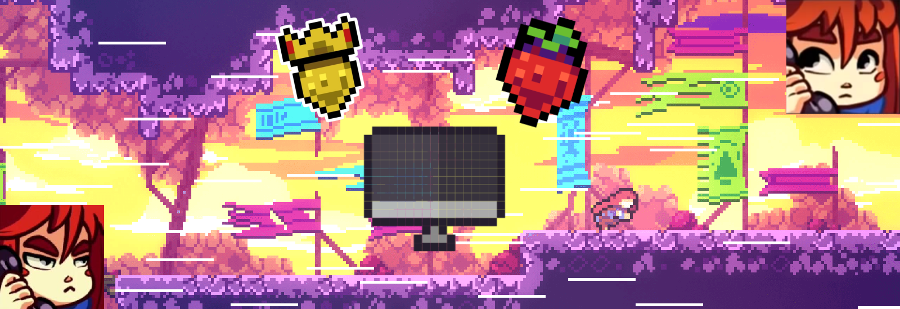
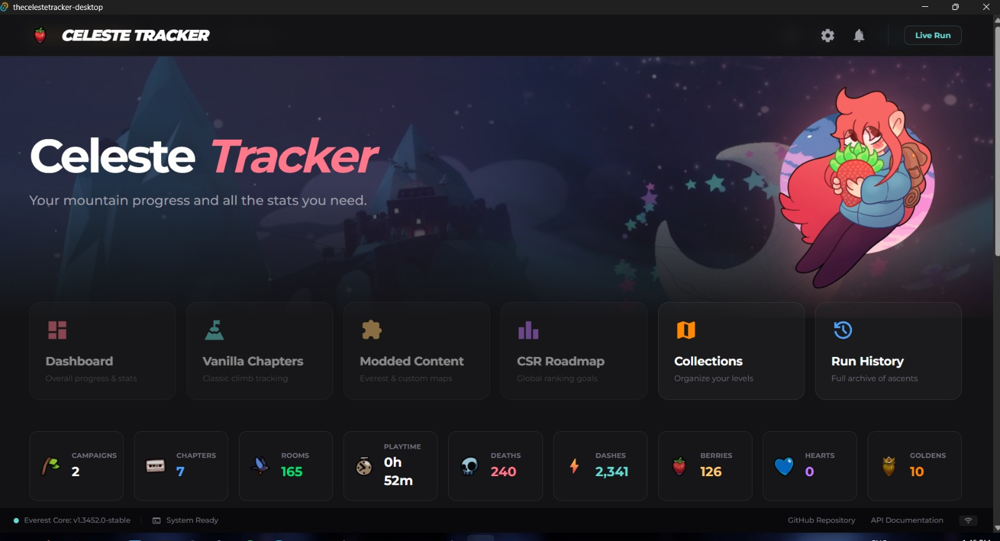
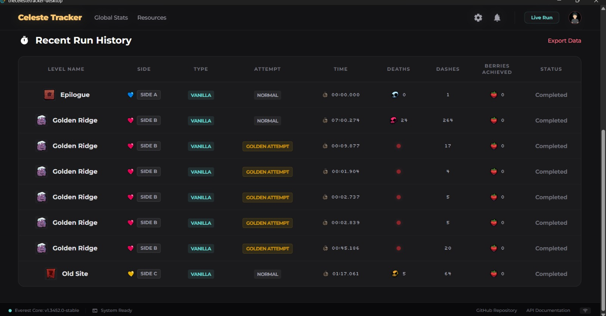

# TheCelesteTracker Desktop

<div align="center">
  

  ### **Stop tracking Celeste in Excel.**
  *Auto-track runs, deaths, and progress with zero manual effort.*

  [Features](#features) • [Tech Stack](#tech-stack) • [Getting Started](#getting-started) • [Architecture](#architecture)
</div>

---

**TheCelesteTracker** is a high-performance desktop companion for Celeste. It captures real-time gameplay data giving you instant insights without the manual data entry.

> ***Still under development, not ready for usage***

## Why this exists?
The Celeste community uses **spreadsheets** for pretty much everything: achievements, map progress, lobby stats—all manual.
**No more.** TheCelesteTracker aims to automate the "Excel grind" so you can focus on the "Celeste grind."

<div align="center">
  <table style="width: 100%; border-collapse: collapse;">
    <tr>
      <th align="center">Manual Excel (The Past)</th>
      <th align="center">Auto Desktop App (The Future)</th>
    </tr>
    <tr>
      <td align="center">
        
        <p><sub><i>This is my real Excel that I use to track my Celeste modding and vanilla progress.</i></sub></p>
      </td>
      <td align="center">
        
        <p><sub><i>Automating with a dedicated app, including support for "Celeste Skill Rating" maps (planned feature).</i></sub></p>
      </td>
    </tr>
  </table>
</div>

Note: While there are mods to track this info, they are all in-game, limited by the interface, and sometimes have a learning curve that makes them hard to use.

<!-- ## Key Features

- **🔄 Real-time Sync**: Auto-connect to Everest WebSocket server.
- **🔍 Auto-Port Scanning**: Instant discovery (ports `50500`-`50600`).
- **🎭 Live Overlay**: Immersive HUD triggers on level entry.
- **📊 Deep Stats**: Track `Deaths`, `Dashes`, `AreaCompletion`, and `Personal Bests`.
- **🐹 Go-Backed**: Fast and reliable event handling via Wails. -->

## Preview

https://github.com/user-attachments/assets/b3583abc-d71b-4a0a-a61a-d4abebb43749
<p><i>Live gameplay event tracking in action.</i></p>

<div align="center">
  
  <p><i>History tracking for recent runs and PB attempts.</i></p>
</div>

*Current UI is subject to change during beta.*

## Tech Stack
- **Framework**: [Neutralinojs](https://neutralino.js.org/) (Lightweight portable desktop application framework)
- **Frontend**: [Svelte 5](https://svelte.dev/) + [Vite](https://vite.dev/) + TypeScript
- **Package Manager**: [Bun](https://bun.sh/) (Runner + Dev tooling)

## Why are you using C and Go as separated extensions?
For fun. I wanted to learn how to package and code very small-easy (except C) programs. Also, gaining a little performance in
final binary size and speed. Perfectly the C extension could be written in Go or Rust + sqlitelib or direct sqlite .h-.c files.
Just wanted to challenge myself

## Getting Started

### Prerequisites
- **Bun**: [Bun Installation](https://bun.sh/)
- **Neutralino CLI**: Install globally using:
  ```bash
  npm install -g @neutralinojs/neu
  ```
- **Celeste Mod**: Install **TheCelesteTracker-Mod** in Everest. Currently available via [GitHub](https://github.com/KristanLaimon/TheCelesteTracker-Mod) (coming soon to GameBanana).

### Installation
1. Clone the repository:
   ```bash
   git clone https://github.com/KristanLaimon/TheCelesteTracker_Desktop.git
   cd TheCelesteTracker_Desktop
   ```
2. Install dependencies (this will automatically run `neu update` to download the required Neutralino binaries):
   ```bash
   bun install
   ```

### Development
To run the app in development mode with live reload and inspection enabled:
```bash
bun run dev
```

### Production Build
To bundle the frontend assets and package the executable binaries:
```bash
bun run build
```
The final executable packages and `resources.neu` will be generated in the `dist/myapp/` directory.

## Architecture
- `neutralino.config.json`: Configuration for the Neutralinojs app runtime, build settings, and permission list.
- `vite.config.ts`: Configuration for Vite bundler, configured to output client builds to the `resources/` directory to avoid colliding with Neutralino's `dist/` directory.
- `src/`: Svelte 5 + TypeScript source code for the frontend UI.

## License
MIT License. Created for the Celeste community.
