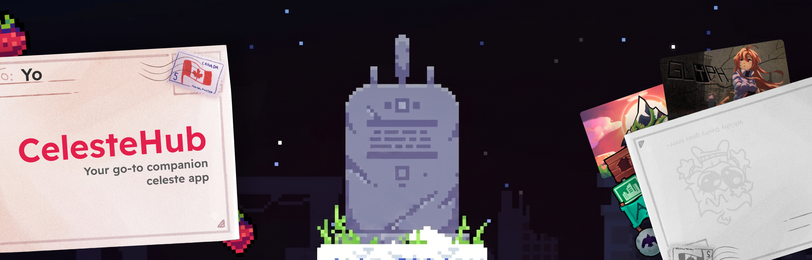
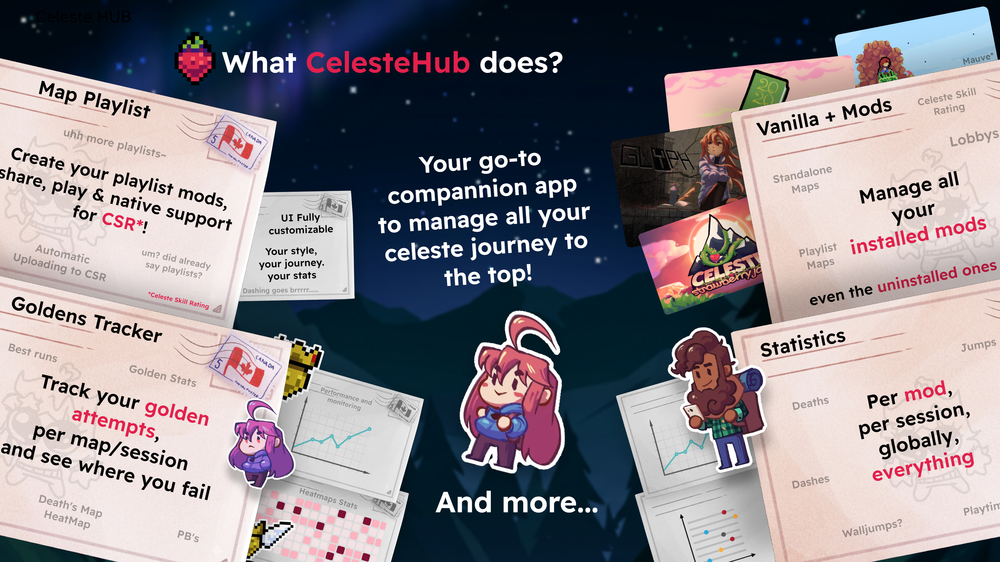
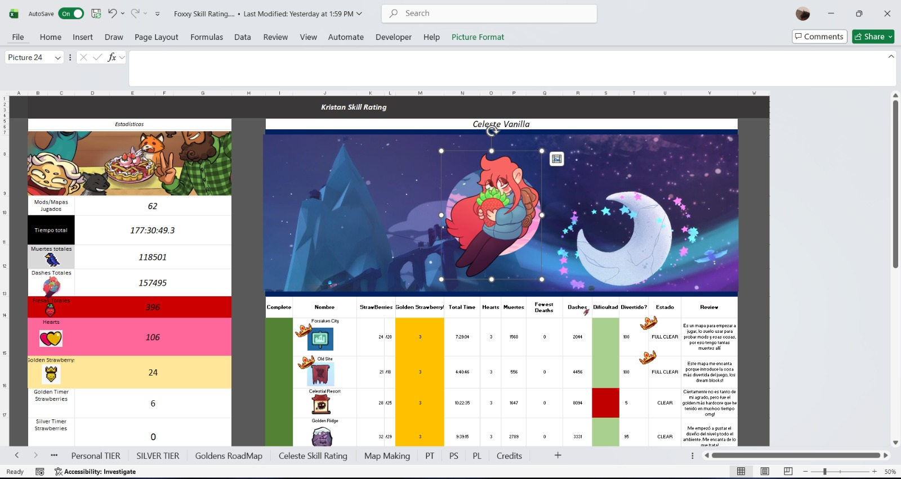
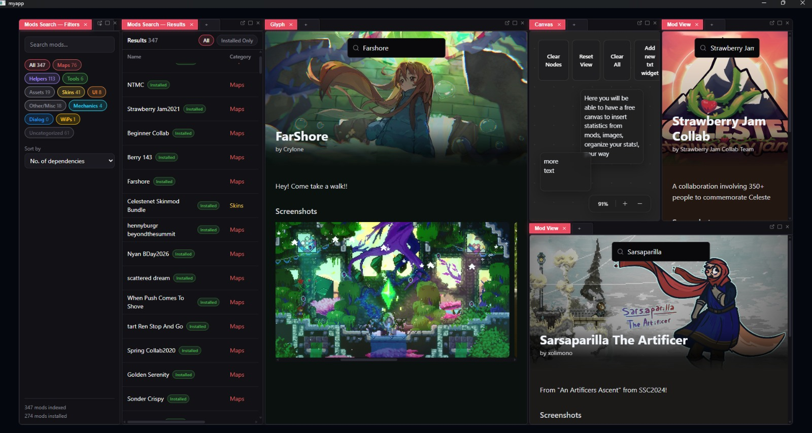
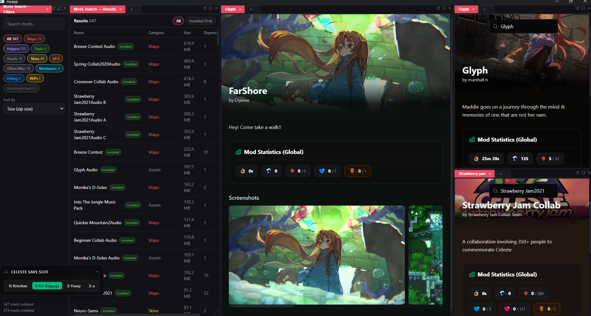

# TheCeleste-Hub Desktop

<div align="center">
  

  ### **Ditch the spreadsheets. Master the mountain.**
  *Your all-in-one companion for stats, mods, and zero-effort progress.*

  [Features](#features) • [Tech Stack](#tech-stack) • [Getting Started](#getting-started) • [Architecture](#architecture)
</div>

---

**TheCelesteHub** is a high-performance desktop companion for Celeste. Tracks your progress trough your vanilla + modded journey, manage your mods, statistics, golden grinding stats and performance, organize your modded/vanilla journey to the top!


# Features




> Note #1: *Rebranding project name to `TheCelesteHub` from `TheCelesteTracker`, so if you found both names, they're the same to this project. Before this was a simple tracker, now the scope of this project is more ambitious hehe*

> Note #2: Still in early development 🚧

## Why this exists?
The Celeste community uses **spreadsheets** for pretty much everything: achievements, map progress, lobby stats—all manual.
**No more.** TheCelesteHub aims to automate the "Excel grind" so you can focus on the "Celeste grind."

<div align="center">
  <table style="width: 100%; border-collapse: collapse;">
    <tr>
      <th align="center">Manual Excel (The Past)</th>
      <th align="center">Auto Desktop App (The Future)</th>
    </tr>
    <tr>
      <td align="center">
        
        <p><sub><i>This is my real Excel that I use to track my Celeste modding and vanilla progress.</i></sub></p>
      </td>
      <td align="center">
        
        <p><sub><i>Automating with a dedicated app, including support for "Celeste Skill Rating" maps (planned feature).</i></sub></p>
      </td>
    </tr>
  </table>
</div>

Note: While there are mods to track this info, they are all in-game, limited by the interface, and sometimes have a learning curve that makes them hard to use.


## Early-dev screenshots

***Current UI is subject to change, working on a way-better design***

<div align="center">
  
  <p><i>Automatic mod metadata fetching, current statistics, and multi-visualization (Currently in Alpha)</i></p>
</div>

<div align="center">
  
  <p><i>Full customizable UI for your stats-visual-stunning needs!</i></p>
</div>

But I expect to implement:

- full mod tracking in real time
- canvas-like to accomodate your stats
- beautiful mods searching and looking (kinda implemented)
- and much more


## Code Mods - Native support for:
- DeathMarkers | https://github.com/oatmealine/DeathMarkers/
- Collab Utils 2 | https://github.com/EverestAPI/CelesteCollabUtils2
- Alt Sides Helper | https://github.com/l-Luna/AltSidesHelper


## Maps Mods - Native Exclusive Support for:
- StrawberryJam2021 | https://github.com/StrawberryJam2021/StrawberryJam2021 & https://gamebanana.com/mods/424541
- SpringCollab | https://github.com/EverestAPI/SpringCollab2020 & https://gamebanana.com/mods/150813
- Breeze Contest | https://gamebanana.com/mods/554453 & (I haven't found any code repo for this one.. (yet))

## Tech Stack
- **Framework**: [Neutralinojs](https://neutralino.js.org/) (Lightweight portable desktop application framework)
- **Frontend**: [Svelte 5](https://svelte.dev/) + [Vite](https://vite.dev/) + TypeScript
- **Package Manager**: [Bun](https://bun.sh/) (Runner + Dev tooling)
- **Cli Helper**: Golang 

Note: We're using neutralino but not neutralino extensions, I went to the easy way by creating a small golang helper CLI, and that's it...

## Getting Started

### Prerequisites
- **Bun**: [Bun Installation](https://bun.sh/)
- **Neutralino CLI**: Install globally using:
  ```bash
  npm install -g @neutralinojs/neu
  ```
- **Celeste Mod**: Install **TheCelesteTracker-Mod** in Everest. Currently available via [GitHub](https://github.com/KristanLaimon/TheCelesteTracker-Mod) (coming soon to GameBanana).

### Installation
1. Clone the repository:
   ```bash
   git clone https://github.com/KristanLaimon/TheCelesteTracker_Desktop.git
   cd TheCelesteTracker_Desktop
   ```
2. Install dependencies (this will automatically run `neu update` to download the required Neutralino binaries):
   ```bash
   bun install
   ```

### Development
To run the app in development mode with live reload and inspection enabled:
```bash
bun run dev
```

### Production Build
To bundle the frontend assets and package the executable binaries:
```bash
bun run build
```
The final executable packages and `resources.neu` will be generated in the `dist/myapp/` directory.

# Acknowledgments & Credits

- Thanks to [Maddies](https://maddie480.ovh) for their easy-to-use apis. Literally mods fetching metadata couldn't be possible without it. (You can't fetch gamebanana mods metadata easily by mod name, only by mod id, whose doesn't exist in olympus!, ahhh!)
- Images/Stickers and other assets were found in these links:

	- https://www.reddit.com/r/celestegame/comments/1qb2l20/madeline_drawing/   |  Author: I_HaveBrainDamage (Celeste Characters Stickers) 

	- https://www.reddit.com/r/celestegame/comments/1uzgea4/chibified_the_cast/ |  Author:  fudgebiscuitz (Maddie Funny Chibbified Sticker)


## Some notes
Hehe I know the repo root is kinda messy due to maddiesapi, gamebananaapi, everest testing, i need to do some chores there.

## AI?
The usage of AI could be kinda problematic when not used propertly.
The AI used in this project is always done using plan and *100% Human-Reviewing*, every new line of code is being read and questioned by me (at the time of writing this). Its a tool that's here to stay.
_*No VIBE-CODED contributions are allowed. (At least read what are you PR'ing (?))*_

## License
MIT License. Created by and for the Celeste community. [Here](./LICENSE.md)

