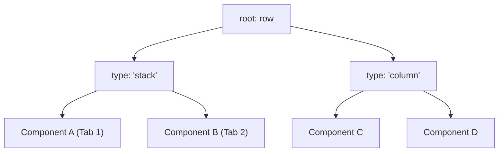

# 🌟 Golden Layout v2 Integration Guide (Svelte 5)

This documentation details the basics of **Golden Layout v2**, how layout configurations and tabs operate, and how to seamlessly mount and clean up **Svelte 5 components** inside a Golden Layout environment.

---

## 📖 Table of Contents
1. [Core Concepts](#1-core-concepts)
2. [Layout Config Structure](#2-layout-config-structure)
3. [How Content & Tabs Work](#3-how-content--tabs-work)
4. [Mounting Svelte 5 Components](#4-mounting-svelte-5-components)
5. [Dynamic Operations (Adding Tabs & Resizing)](#5-dynamic-operations-adding-tabs--resizing)
6. [Applying Themes](#6-applying-themes)
7. [Custom Header Buttons (Injecting Elements)](#7-custom-header-buttons-injecting-elements)
8. [Advanced Placement: addComponentAtLocation](#8-advanced-placement-addcomponentatlocation)

---

## 1. Core Concepts

Golden Layout is a powerful multi-window layout manager. It parses a tree structure configuration and creates a nested grid of rows, columns, stacks, and components.

### Layout Tree Nodes
*   **Row**: Arranges child items horizontally (side-by-side).
*   **Column**: Arranges child items vertically (stacked on top of each other).
*   **Stack**: A tabbed container. Children of a Stack are rendered as tabs that the user can switch between.
*   **Component**: The actual panel where your content is rendered. It must be registered with a factory function.

---

## 2. Layout Config Structure

Golden Layout configurations are typed configurations (`LayoutConfig`). Below is a visual representation of how a layout configuration maps to a visual interface:



### JSON Configuration Example
```typescript
import type { LayoutConfig } from "golden-layout";

const config: LayoutConfig = {
  root: {
    type: "row", // Side-by-side arrangement
    content: [
      {
        type: "stack", // Stack container containing tabs
        content: [
          {
            type: "component",
            componentType: "myComponent",
            componentState: { label: "Tab 1 Content" },
            title: "Tab A"
          },
          {
            type: "component",
            componentType: "myComponent",
            componentState: { label: "Tab 2 Content" },
            title: "Tab B"
          }
        ]
      },
      {
        type: "column", // Vertical split next to the stack
        content: [
          {
            type: "component",
            componentType: "myComponent",
            componentState: { label: "Vertical Panel C" },
            title: "Panel C"
          }
        ]
      }
    ]
  }
};
```

---

## 3. How Content & Tabs Work

### Tab Stacking & Drag-and-Drop
1.  **Tab Promotion**: If you drag a component panel and drop it directly onto the header of another component panel, Golden Layout automatically creates a `Stack` and promotes both panels into tabs.
2.  **Closability**: You can control whether tabs can be closed by configuring the `isClosable: false` attribute in the item's config.
3.  **Active Tab Management**: In Golden Layout v2, you can use the stack API to retrieve or set active tabs programmatically:
    ```typescript
    // Set active tab programmatically
    stack.setActiveComponentItem(componentItem);
    ```

---

## 4. Mounting Svelte 5 Components

To render Svelte 5 components inside Golden Layout panels, you mount them directly onto the DOM element provided by Golden Layout's `ComponentContainer` inside a registered factory function.

> [!IMPORTANT]
> Svelte 5 replaces the class-based `$destroy()` method with the functional `unmount()` utility. Always call `unmount` inside the container's `onDestroy` hook to prevent memory leaks!

### Step-by-Step Implementation

#### 1. Define your Svelte component (`DashboardWidget.svelte`)
```html
<script lang="ts">
  // Retrieve properties passed from GoldenLayout componentState
  let { title, description } = $props<{ title: string; description: string }>();
  let count = $state(0);
</script>

<div class="widget-card">
  <h3>{title}</h3>
  <p>{description}</p>
  
  <div class="interactive-area">
    <button onclick={() => count++}>Count: {count}</button>
  </div>
</div>

<style>
  .widget-card {
    padding: 1rem;
    background: #111827;
    color: #e2e8f0;
    border-radius: 8px;
    height: 100%;
  }
  button {
    background: #3b82f6;
    color: white;
    border: none;
    padding: 0.5rem 1rem;
    border-radius: 4px;
    cursor: pointer;
  }
</style>
```

#### 2. Register & mount the component inside the Svelte parent page
```html
<script lang="ts">
  import { onMount, unmount } from "svelte";
  import { mount } from "svelte";
  import { GoldenLayout } from "golden-layout";
  import DashboardWidget from "./DashboardWidget.svelte";

  import "golden-layout/dist/css/goldenlayout-base.css";
  import "golden-layout/dist/css/themes/goldenlayout-dark-theme.css";

  let layout: GoldenLayout;

  onMount(() => {
    const containerEl = document.getElementById("layout-container");
    if (!containerEl) return;

    layout = new GoldenLayout(containerEl);

    // Register Svelte Component Factory
    layout.registerComponentFactoryFunction("dashboardWidget", (container, state) => {
      // 1. Mount the Svelte 5 Component onto the container's element
      const componentInstance = mount(DashboardWidget, {
        target: container.element,
        props: {
          title: (state as any)?.title || "Default Title",
          description: (state as any)?.description || "Default Description"
        }
      });

      // 2. Register destroy callback to unmount Svelte component correctly
      container.onDestroy(() => {
        unmount(componentInstance);
      });
    });

    // Load initial layout config
    layout.loadLayout({
      root: {
        type: "row",
        content: [{
          type: "component",
          componentType: "dashboardWidget",
          componentState: { title: "Analytics Panel", description: "Tracks real-time system usage." }
        }]
      }
    });

    // Resize handling using ResizeObserver
    const resizeObserver = new ResizeObserver(() => {
      if (layout) layout.setSize(containerEl.clientWidth, containerEl.clientHeight);
    });
    resizeObserver.observe(containerEl);

    return () => {
      resizeObserver.disconnect();
      layout.destroy();
    };
  });
</script>

<div id="layout-container" style="width: 100%; height: 100vh;"></div>
```

---

## 5. Dynamic Operations (Adding Tabs & Resizing)

### Programmatic Tab Insertion
To append tabs to the screen dynamically without requiring a full layout reload, use the `.addComponent()` method:

```typescript
function addNewWidget() {
  if (!layout) return;

  layout.addComponent(
    "dashboardWidget", // Registered component type
    { 
      title: "New Panel", 
      description: "Added programmatically at runtime." 
    }, 
    "New Tab" // Header tab title
  );
}
```
*Golden Layout v2 determines the best position for the new tab automatically (e.g. focusing it inside the active stack, or appending it as a new layout branch).*

### Auto-Resizing Container
By default, Golden Layout does not resize when its parent container element changes size. Wrap it in a **`ResizeObserver`** to ensure it resizes smoothly when the browser window, toolbars, or sidebars expand or contract:

```typescript
const resizeObserver = new ResizeObserver(() => {
  if (layout && containerElement) {
    layout.setSize(containerElement.clientWidth, containerElement.clientHeight);
  }
});
resizeObserver.observe(containerElement);
```

---

## 6. Applying Themes

Golden Layout comes bundled with a base CSS file and several predefined color themes to fit the style of your application.

### Predefined Themes
The following CSS theme files are located in the `golden-layout/dist/css/themes/` directory:
*   `goldenlayout-dark-theme.css` — Standard dark mode theme.
*   `goldenlayout-light-theme.css` — Standard light mode theme.
*   `goldenlayout-borderless-dark-theme.css` — Dark theme without prominent borders.
*   `goldenlayout-soda-theme.css` — Custom clean Soda theme.
*   `goldenlayout-translucent-theme.css` — Semi-transparent dark theme.

### How to Import Themes
To apply a theme, import the base CSS stylesheet followed by your chosen theme stylesheet inside your component script:

```typescript
// 1. Always import the base stylesheet first
import "golden-layout/dist/css/goldenlayout-base.css";

// 2. Import one of the predefined theme stylesheets
import "golden-layout/dist/css/themes/goldenlayout-dark-theme.css";
// OR: import "golden-layout/dist/css/themes/goldenlayout-light-theme.css";
// OR: import "golden-layout/dist/css/themes/goldenlayout-borderless-dark-theme.css";
// OR: import "golden-layout/dist/css/themes/goldenlayout-soda-theme.css";
// OR: import "golden-layout/dist/css/themes/goldenlayout-translucent-theme.css";
```

### Custom Theme Styling
If you want to style the layout tabs, headers, drag-proxies, or splitters yourself, you can target Golden Layout's native CSS classes. Below are the primary classes to override:

| Class Selector | Description |
| :--- | :--- |
| `.lm_header` | The header bar holding the tabs and control buttons. |
| `.lm_tab` | The tab element itself. |
| `.lm_tab.lm_active` | The currently active tab. |
| `.lm_content` | The content container holding the panel children. |
| `.lm_splitter` | The draggable divider lines between columns and rows. |
| `.lm_dragProxy` | The temporary floating window showing drag progress. |
```

---

## 7. Custom Header Buttons (Injecting Elements)

In Golden Layout v2, there is no direct config option to add custom header buttons (like a `+` button to create tabs). However, you can listen to stack creation events and manipulate the DOM container natively:

### Implementation Example

Listen for the `"itemCreated"` event on the `GoldenLayout` instance. If the created item is a `Stack`, retrieve its header controls element and append your button:

```typescript
layout.on("itemCreated", (event) => {
  const item = event.target as any; // Cast target
  
  if (item.isStack) {
    const stack = item;
    
    // 1. Create a native HTML button
    const addButton = document.createElement("button");
    addButton.textContent = "+";
    addButton.style.marginLeft = "4px";
    addButton.style.cursor = "pointer";
    addButton.style.background = "#2563eb";
    addButton.style.color = "#ffffff";
    addButton.style.borderRadius = "4px";
    addButton.title = "Add a new tab to this stack";
    
    addButton.onclick = () => {
      // Logic to add a new tab to THIS specific stack
      stack.newComponent("testComponent", { label: "New" }, "Dynamic Tab");
    };
    
    // 2. Append button to the header's controls container
    setTimeout(() => {
      if (stack.header && stack.header.controlsContainerElement) {
        stack.header.controlsContainerElement.appendChild(addButton);
      }
    }, 50); // Small timeout ensures header DOM elements are fully initialized
  }
});
```

---

## 8. Advanced Placement: `addComponentAtLocation`

If you want to add a tab to a specific region instead of the focused container, you can use:
```typescript
layout.addComponentAtLocation(
  componentType: string, 
  componentState: any, 
  title: string, 
  locationSelectors: LocationSelector[]
);
```

### Location Selector Configurations

The `locationSelectors` parameter is an array of `LocationSelector` objects. Golden Layout will evaluate each selector in order and insert the tab at the first match:

```typescript
import { LayoutManager } from "golden-layout";

layout.addComponentAtLocation("testComponent", { label: "Y" }, "CUSTOM LOCATION TITLE", [
  { typeId: LayoutManager.LocationSelector.TypeId.FirstStack }
]);
```

### Selector TypeId Values
Below are the available algorithm types you can assign to `typeId`:

| LocationSelector.TypeId | Value | Description |
| :--- | :--- | :--- |
| `FocusedItem` | `0` | Place next to the currently focused tab. |
| `FocusedStack` | `1` | Place inside the currently focused stack. |
| `FirstStack` | `2` | Place inside the first stack found in the layout. |
| `FirstRowOrColumn` | `3` | Place inside the first Row or Column found. |
| `FirstRow` | `4` | Place inside the first Row. |
| `FirstColumn` | `5` | Place inside the first Column. |
| `Empty` | `6` | Place as root if the layout is empty. |
| `Root` | `7` | Place as child under the root item. |

If no selectors are provided, Golden Layout defaults to `[ { typeId: TypeId.FocusedItem }, { typeId: TypeId.FocusedStack }, { typeId: TypeId.FirstStack } ]` to guarantee the component is added somewhere visible.
