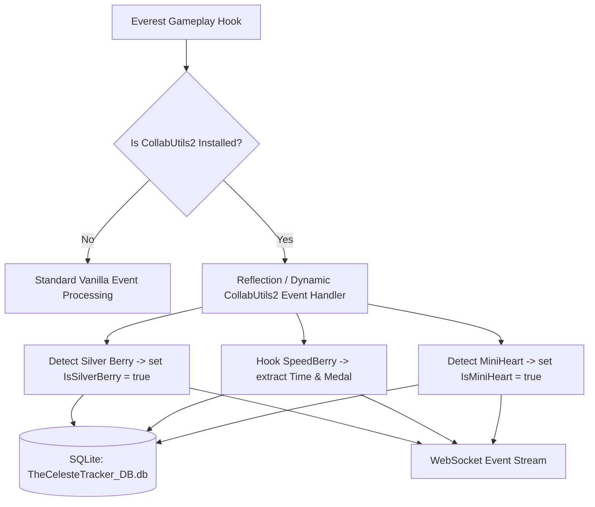

# Implementation Plan: Collab Utils 2 Support in `TheCelesteTracker-Mod`

> **Target Audience**: AI Agent / Developer implementing C# changes in [TheCelesteTracker-Mod](https://github.com/KristanLaimon/TheCelesteTracker-Mod).  
> **Goal**: Add complete support for Collab Utils 2 custom entities (**Silver Berries**, **Speed Berries**, and **Mini Hearts**) into `TheCelesteTracker-Mod` runtime hooks, SQLite database (`TheCelesteTracker_DB.db`), and WebSocket event stream.

---

## 1. Background & Context

### What is `TheCelesteTracker-Mod`?
`TheCelesteTracker-Mod` is an Everest (Celeste) C# mod that:
1. Listens to gameplay events (room transitions, dashes, deaths, entity collection, level completion).
2. Persists run and death history to an SQLite database located at `Celeste/Saves/TheCelesteTracker_DB.db`.
3. Streams real-time JSON events over WebSockets (port 50500, auto-hunting up to 50600) to `TheCelesteTrackerDesktop`.

### The Problem
Currently, `TheCelesteTracker-Mod` only handles vanilla Celeste entities and basic Everest hooks:
* **Silver Berries**: missed because they are an instance of `Celeste.Mod.CollabUtils2.Entities.SilverBerry` (or inherit from custom berry classes) rather than standard `Celeste.GoldenBerry`.
* **Speed Berries**: missed because they do not write to `SaveData.Strawberries` in `N.celeste` XML. Their times live in `CollabUtils2Module.SaveData.SpeedBerryPBs`.
* **Mini Hearts**: completed maps trigger standard level end, but `TheCelesteTracker-Mod` does not flag `"isMiniHeart": true` in WebSocket payloads for desktop app UI differentiation.

---

## 2. Architectural Design & Optional Dependency Pattern

> [!IMPORTANT]
> **Collab Utils 2 is an optional dependency.** `TheCelesteTracker-Mod` MUST NOT hard-reference CollabUtils2 DLLs directly if it causes `TypeLoadException` when Collab Utils 2 is not installed by the player.  
> Use **reflection** or **Everest mod metadata check** (`Everest.Modules.Any(m => m.Metadata.Name == "CollabUtils2")`) before executing CollabUtils2-specific hooks!



---

## 3. Detailed Technical Tasks & Code Snippets

### Task 1: Detect Silver Berries in Deathless Runs

#### Problem Detail
In vanilla, a golden run is detected by checking `player.Leader.Has<GoldenBerry>()` or checking `entity is GoldenBerry`. Silver Berries in Collab Utils 2 are a separate entity (`Celeste.Mod.CollabUtils2.Entities.SilverBerry`).

#### Proposed C# Solution
Create a helper method `IsGoldenOrSilverBerry(Entity entity)` in `TheCelesteTracker-Mod`:

```csharp
using System;
using Monocle;
using Celeste;

public static class CollabUtils2Helper
{
    private static bool? _isCollabUtils2Loaded;

    public static bool IsCollabUtils2Installed()
    {
        if (!_isCollabUtils2Loaded.HasValue)
        {
            _isCollabUtils2Loaded = Everest.Modules.Any(m => m.Metadata?.Name == "CollabUtils2");
        }
        return _isCollabUtils2Loaded.Value;
    }

    public static bool IsSilverBerry(Entity entity)
    {
        if (!IsCollabUtils2Installed() || entity == null) return false;
        
        string typeName = entity.GetType().FullName;
        return typeName == "Celeste.Mod.CollabUtils2.Entities.SilverBerry";
    }

    public static bool IsGoldenOrSilverBerry(Entity entity)
    {
        if (entity is GoldenBerry) return true;
        return IsSilverBerry(entity);
    }
}
```

#### Updates to Run Collector State:
When player picks up a Silver Berry:
1. Set `CurrentRun.IsGoldenRun = true` (or `IsSilverRun = true`).
2. Emit WebSocket event:
   ```json
   {
     "event": "berry_collected",
     "berryType": "silver",
     "sid": "SpringCollab2020/1-Beginner/Abby"
   }
   ```

---

### Task 2: Track Speed Berry Times & Medals

#### Problem Detail
Speed Berries are timed berries. The player picks up a Speed Berry, a countdown timer starts, and crossing a `SpeedBerryCollectTrigger` stops the timer. If time exceeds Bronze, the player dies.

Collab Utils 2 saves Speed Berry PBs in:
`Celeste.Mod.CollabUtils2.CollabUtils2Module.SaveData.SpeedBerryPBs` (Dictionary of `string` map SID -> `long` time in 100ns ticks).

#### Proposed C# Solution
1. Listen to level end / Speed Berry collect triggers.
2. Read the PB dictionary safely via reflection:

```csharp
public static long? GetSpeedBerryPB(string sid)
{
    if (!IsCollabUtils2Installed()) return null;
    try
    {
        // Access CollabUtils2Module.SaveData.SpeedBerryPBs via reflection
        var moduleType = Type.GetType("Celeste.Mod.CollabUtils2.CollabUtils2Module, CollabUtils2");
        if (moduleType == null) return null;

        var saveDataProp = moduleType.GetProperty("SaveData");
        var saveDataObj = saveDataProp?.GetValue(null);
        if (saveDataObj == null) return null;

        var pbsProp = saveDataObj.GetType().GetProperty("SpeedBerryPBs");
        var pbsDict = pbsProp?.GetValue(saveDataObj) as System.Collections.IDictionary;
        if (pbsDict != null && pbsDict.Contains(sid))
        {
            return Convert.ToInt64(pbsDict[sid]);
        }
    }
    catch (Exception ex)
    {
        Logger.Log(LogLevel.Warn, "TheCelesteTracker", $"Failed to read SpeedBerryPB for {sid}: {ex}");
    }
    return null;
}
```

3. Update SQLite DB table `Runs` (or `LevelCompletions`) with columns:
   - `speed_berry_time_ms` (INTEGER, nullable)
   - `speed_berry_medal` (TEXT: `"gold"`, `"silver"`, `"bronze"`, nullable)

4. Emit WebSocket Event:
   ```json
   {
     "event": "speed_berry_complete",
     "sid": "SpringCollab2020/1-Beginner/Abby",
     "timeMs": 512720,
     "medal": "gold",
     "isPB": true
   }
   ```

---

### Task 3: Flag Mini Hearts in Level Completion Events

#### Problem Detail
Mini Hearts end the level via `MiniHeart.OnPlayer(Player player)` entity callback.

#### Proposed C# Solution
Hook or check the entity that triggered level end:

```csharp
public static bool IsMiniHeartEntity(Entity entity)
{
    if (!IsCollabUtils2Installed() || entity == null) return false;
    return entity.GetType().FullName == "Celeste.Mod.CollabUtils2.Entities.MiniHeart";
}
```

In the level completion event handler:
```csharp
bool isMiniHeart = CollabUtils2Helper.IsMiniHeartEntity(completingEntity);

var wsPayload = new {
    event = "level_complete",
    sid = session.Area.GetSID(),
    time = session.Time,
    deaths = session.Deaths,
    dashes = session.Dashes,
    heartCollected = session.HeartGem || isMiniHeart,
    isMiniHeart = isMiniHeart
};
```

---

## 4. SQLite Schema Updates (`TheCelesteTracker_DB.db`)

Add optional columns to the `Runs` table in `TheCelesteTracker_DB.db`:

```sql
ALTER TABLE Runs ADD COLUMN is_silver_berry INTEGER DEFAULT 0;
ALTER TABLE Runs ADD COLUMN is_mini_heart INTEGER DEFAULT 0;
ALTER TABLE Runs ADD COLUMN speed_berry_time_ms INTEGER DEFAULT NULL;
ALTER TABLE Runs ADD COLUMN speed_berry_medal TEXT DEFAULT NULL;
```

---

## 5. Implementation Step-by-Step Checklist for AI Session

- [ ] **Step 1**: Create `CollabUtils2Helper.cs` in `TheCelesteTracker-Mod` project under `Utils/` or `Helpers/`.
- [ ] **Step 2**: Add `IsCollabUtils2Installed()`, `IsSilverBerry()`, and `IsMiniHeartEntity()` using reflection.
- [ ] **Step 3**: Update entity collection listener to set `IsSilverBerry = true` when picking up a Silver Berry.
- [ ] **Step 4**: Add `GetSpeedBerryPB(sid)` helper and trigger WebSocket event on Speed Berry completion.
- [ ] **Step 5**: Pass `"isMiniHeart": true` in WebSocket `level_complete` payload.
- [ ] **Step 6**: Execute DB migration to add optional columns (`is_silver_berry`, `is_mini_heart`, `speed_berry_time_ms`, `speed_berry_medal`) to `TheCelesteTracker_DB.db`.
- [ ] **Step 7**: Test in Celeste with Collab Utils 2 enabled and disabled to verify zero regressions when Collab Utils 2 is not installed.
