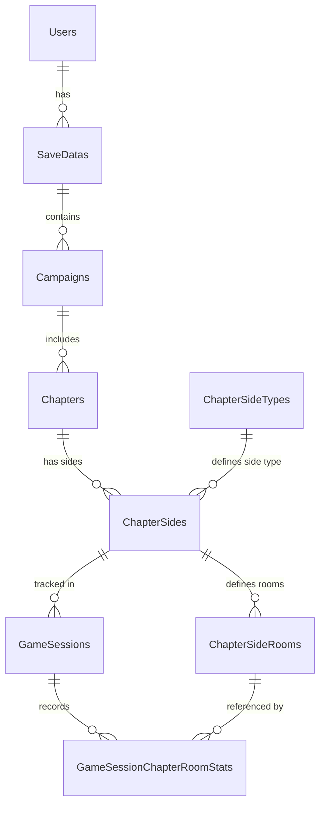

# DO NOT MODIFY THIS SCHEMA, IS ONLY FOR REFERENCE. "Database_TheCelesteDesktop.md will be the database used here, so you must set SQL CODE, to addapt this schema without delete any DATA, to the scheme ain "Database_TheCelesteDesktop.md"

# TheCelesteTracker Database Schema (Full Reference)

Relational model for high-granularity tracking of Celeste gameplay statistics.
**Location:** `Saves/TheCelesteTracker.db` (SQLite)

---

## Writing Intentions

The database is designed to provide:

1.  **High Granularity:** Room-by-room statistics (deaths, dashes, jumps) for every gameplay session.
2.  **Campaign Isolation:** Separation of stats between Vanilla Celeste and various Modded LevelSets (e.g., Strawberry Jam, Spring Collab).
3.  **Cross-Save Analytics:** Ability to aggregate progress across different save slots and users.
4.  **Session-Based Tracking:** Distinction between a "Chapter Playthrough" (Session) and persistent "Save Data" stats.
5.  **Golden Berry Analysis:** Specific flags for tracking Golden Berry attempts and completions.

---

## Entity Relationships

The schema follows a strict hierarchical tree from the user down to individual room statistics.



### Hierarchy Breakdown:

1.  **Global Level:** `Users` -> `SaveDatas`. One system user can have multiple Celeste save slots.
2.  **Campaign Level:** `SaveDatas` -> `Campaigns`. Each save slot tracks multiple "Campaigns" (LevelSets like Vanilla, SJ, etc.).
3.  **Chapter Level:** `Campaigns` -> `Chapters`. Each campaign contains its unique set of chapters.
4.  **Structure Level:** `Chapters` acts as a parent for `ChapterSides` (SIDEA/SIDEB/SIDEC).
5.  **Room Level:** `ChapterSides` defines `ChapterSideRooms` (static room definitions per side).
6.  **Activity Level:** `ChapterSides` -> `GameSessions`. Every time you enter a level, a session is created for that specific side.
7.  **Granular Level:** `GameSessions` -> `GameSessionChapterRoomStats`. Per-room performance is logged within the context of a session.

## Event-Driven Management

The database is managed through specific Everest/Celeste hooks that trigger record creation or updates based on in-game actions.

### 1. Initialization Hooks (Context Setup)

Triggered when a chapter is entered from the Map or a Save Slot is loaded.

- **Hook:** `On.Celeste.SaveData.StartSession`
- **Action:** Calls `DB.Session_EnsureInDB`.
- **Managed Tables:**
  - `Users`: Verified/Created once per mod lifecycle.
  - `SaveDatas`: Synced with current slot.
  - `Campaigns`: Creates entry for current LevelSet.
  - `Chapters`: Generates the composite SID.
  - `ChapterSides`: Upserts available berries and current progress.

### 2. Room Transitions (Metadata Collection)

Triggered when entering a new room.

- **Hook:** `On.Celeste.Level.LoadLevel`
- **Action:** Logs entry into a new room and initializes its entry in `ChapterSideRooms` (if missing).
- **Managed Tables:** `ChapterSideRooms`, `GameSessionChapterRoomStats` (in-memory initialization).

### 3. Gameplay Activity (Live Increments)

These hooks update the **current active session** in memory, which is later flushed to the DB.

- **Player Death (`On.Celeste.Player.Die`):** Increments `deaths_in_room`.
- **Jump (`On.Celeste.Player.Jump`):** Increments `jumps_in_room`.
- **Dash (`On.Celeste.Player.DashBegin`):** Increments `dashes_in_room`.
- **Strawberry Grab (`On.Celeste.Strawberry.OnPlayer`):** Sets `is_goldenberry_attempt` if golden.
- **Strawberry Collect (`On.Celeste.Strawberry.OnCollect`):**
  - Increments `strawberries_achieved_in_room`.
  - Increments `berries_collected` in `ChapterSides` (Persistent sync).
  - Sets `is_goldenberry_completed` if golden.
- **Heart Collect (`On.Celeste.HeartGem.Collect`):**
  - Increments `hearts_achieved_in_room`.
  - Sets `heart_collected` to 1 in `ChapterSides`.
- **Chapter Completion (`On.Celeste.Level.RegisterAreaComplete`):**
  - Broadcasts `ChapterCompleted` event.

### 4. Session Finalization (Persistence)

Triggered when leaving a level or closing the game.

- **Hooks:** `On.Celeste.Level.End`, `Everest.Events.Celeste.OnShutdown`.
- **Action:** Flushes the entire `GameSession` DTO to the database in a single transaction.
- **Managed Tables:**
  - `GameSessions`: Final duration and golden status recorded.
  - `GameSessionChapterRoomStats`: All accumulated room stats are inserted.

---

## ID Shapes and String Formats

### Campaign Name ID

Represents the "LevelSet" in Everest.

- **Vanilla:** `Celeste`
- **Mods:** The internal name of the LevelSet (e.g., `StrawberryJam2023/1-Beginner`, `SpringCollab2020/2-Intermediate`).

### Chapter SID (Database Primary Key)

To ensure uniqueness across multiple save slots and campaigns, the database uses a composite-like string:

- **Format:** `{CampaignTableID}:{InternalSID}`
- **Example:** `1:Celeste/1-ForsakenCity`
- **Note:** `CampaignTableID` is the integer primary key from the `Campaigns` table.

### Side ID

Represents the difficulty mode of the chapter.

- **Values:** `SIDEA`, `SIDEB`, `SIDEC`
- **Source:** Generated via `AreaMode.ToStringId()`.

---

erDiagram
Users ||--o{ SaveDatas : "has"
Users {
int id PK
string name
}

     SaveDatas ||--o{ Campaigns : "contains"
     SaveDatas {
         int id PK
         int user_id FK
         int slot_number
         string file_name
     }

     Campaigns ||--o{ Chapters : "manages"
     Campaigns {
         int id PK
         int save_data_id FK
         string campaign_name_id
     }

     Chapters ||--o{ ChapterSides : "has"
     Chapters {
         string sid PK
         int campaign_id FK
         string name
     }

     ChapterSideTypes ||--o{ ChapterSides : "type"
     ChapterSideTypes {
         string id PK "SIDEA, SIDEB, SIDEC"
     }

     ChapterSides ||--o{ ChapterSideRooms : "defines"
     ChapterSides ||--o{ GameSessions : "tracks"
     ChapterSides {
         string chapter_sid PK, FK
         string side_id PK, FK
         int berries_available
         int berries_collected
         int goldenstrawberry_achieved
         int goldenwingstrawberry_achieved
     }

     ChapterSideRooms ||--o{ GameSessionChapterRoomStats : "source"
     ChapterSideRooms {
         string chapter_sid PK, FK
         string side_id PK, FK
         string name PK
         int order
         int strawberries_available
     }

     GameSessions ||--o{ GameSessionChapterRoomStats : "logs"
     GameSessions {
         string id PK
         string chapter_sid FK
         string side_id FK
         string date_time_start
         int duration_ms
         int is_goldenberry_attempt
         int is_goldenberry_completed
     }

     GameSessionChapterRoomStats {
         int id PK
         string gamesession_id FK
         string chapter_sid FK
         string side_id FK
         string room_name FK
         int deaths_in_room
         int dashes_in_room
         int jumps_in_room
         int strawberries_achieved_in_room
         int hearts_achieved_in_room
     }

---

## Common Queries

### 1. Total Playtime (Across all campaigns and saves)

```sql
SELECT
    SUM(duration_ms) / 1000 / 60 / 60 AS total_hours
FROM GameSessions;
```

### 2. Time Breakdown: Vanilla vs Modded

```sql
SELECT
    c.campaign_name_id,
    SUM(gs.duration_ms) / 1000 / 60 AS total_minutes
FROM Campaigns c
JOIN Chapters ch ON c.id = ch.campaign_id
JOIN GameSessions gs ON ch.sid = gs.chapter_sid
GROUP BY c.campaign_name_id;
```

### 3. All Strawberries Collected in A-Sides

```sql
SELECT
    chapter_sid,
    berries_collected,
    berries_available
FROM ChapterSides
WHERE side_id = 'SIDEA';
```

### 4. Room-by-Room Death Leaderboard

```sql
SELECT
    room_name,
    SUM(deaths_in_room) as total_deaths
FROM GameSessionChapterRoomStats
GROUP BY room_name
ORDER BY total_deaths DESC
LIMIT 10;
```

### 5. Golden Berry Completion Rate

```sql
SELECT
    COUNT(*) as total_attempts,
    SUM(is_goldenberry_completed) as successful_completions
FROM GameSessions
WHERE is_goldenberry_attempt = 1;
```

### 6. Heart Completion Progress

```sql
SELECT
    chapter_sid,
    side_id,
    heart_collected
FROM ChapterSides
WHERE heart_collected = 1;
```
