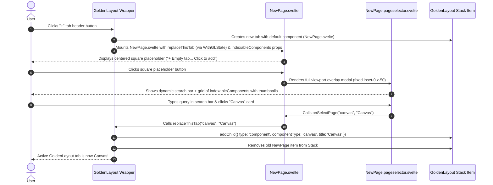

# Implementation Plan - New Empty Tab Page and Viewport-wide Page Selector for GoldenLayout

This document details the strategy for implementing `NewPage.svelte` (the default GoldenLayout empty tab component) and `NewPage.pageselector.svelte` (a viewport-wide overlay modal with dynamic search for selecting available pages).

## Goal Description
When a user opens a new tab in GoldenLayout, the desktop app presents a clean, centered empty tab state featuring a square placeholder button with a `+` icon and text `"Empty tab... press click to add new page"`. Clicking this placeholder opens the Page Selector (`NewPage.pageselector.svelte`) as a **full viewport overlay modal** (`fixed inset-0 z-50`) covering the entire app screen. `NewPage.svelte` receives a mandatory prop `indexableComponents`, which contains the list of indexable pages and their corresponding mandatory `thumbnail` images. Selecting a page immediately replaces the empty tab with the chosen component.

---

## Architecture & Flow Explanation

### Why `replaceThisTab` is in `WithGLState`
In GoldenLayout, each tab is represented by a `ComponentItem` inside a `Stack`. All components hosted in GoldenLayout use `WithGLState<TProps>` to receive GoldenLayout context callbacks.

By adding `replaceThisTab?: (newType: string, title?: string, state?: Record<string, unknown>) => void` directly to `WithGLState`:
1. Any component inside GoldenLayout (like `NewPage.svelte`) can destructure `replaceThisTab` from `$props()`.
2. GoldenLayout's component factory automatically passes `replaceThisTab` without altering component factory prop signatures.

### Step-by-Step Execution Flow


---

## User Review Required

> [!IMPORTANT]
> - **`WithGLState` Enhancement**: `GoldenLayout.types.ts` will include `replaceThisTab?: (newType: string, title?: string, state?: Record<string, unknown>) => void` inside `WithGLState`.
> - **`indexableComponents` Prop**: `NewPage.svelte` accepts `indexableComponents: Array<{ goldenLayoutKey: string; thumbnail: string; title?: string; description?: string; tags?: string[] }>`.
> - **Clean Component Factory**: `GoldenLayout.svelte` passes `replaceThisTab` inside standard component props.
> - **Full Viewport Modal**: `NewPage.pageselector.svelte` uses `fixed inset-0 z-50` with a dark glassmorphism backdrop (`bg-[#121216]/95 backdrop-blur-lg`) to occupy the entire viewport screen.

---

## Proposed Changes

### GoldenLayout Types & Wrapper Framework
#### [MODIFY] [GoldenLayout.types.ts](file:///C:/Users/Kristan/Desktop/Celeste%20Modding/TheCelesteTrackerDesktop/src/libs/GoldenLayoutThemes/GoldenLayout.types.ts)
- Update `WithGLState` to include `replaceThisTab`:

```ts
export type WithGLState<TState extends Record<string, unknown> = Record<string, unknown>> = {
	onStateChange?: (state: Partial<TState>) => void;
	replaceThisTab?: (newType: string, title?: string, state?: Record<string, unknown>) => void;
	glContainer?: any;
} & Partial<TState>;
```

#### [MODIFY] [GoldenLayout.svelte](file:///C:/Users/Kristan/Desktop/Celeste%20Modding/TheCelesteTrackerDesktop/src/libs/GoldenLayoutThemes/GoldenLayout.svelte)
- Pass `replaceThisTab` and `glContainer` in component factory mounting function to satisfy `WithGLState`:

```ts
const replaceThisTab = (newType: string, title?: string, state?: Record<string, unknown>) => {
	const item = container.parent;
	if (!item) return;
	const stack = item.parent;
	const index = stack ? stack.contentItems.indexOf(item) : -1;
	const newComponentConfig = {
		type: "component",
		componentType: newType,
		title: title || newType,
		componentState: state || {},
	};
	if (stack && typeof stack.addChild === "function") {
		const newItem = stack.addChild(newComponentConfig, index !== -1 ? index : undefined);
		item.remove();
		if (newItem && typeof stack.setActiveComponentItem === "function") {
			stack.setActiveComponentItem(newItem);
		}
	}
};
```

---

### Main Application Layout
#### [MODIFY] [Main.svelte](file:///C:/Users/Kristan/Desktop/Celeste%20Modding/TheCelesteTrackerDesktop/src/pages/Main.svelte)
- Import thumbnails from `src/assets/thumbnails/`:
  - `canvasThumbnail` (`available-page-thumbnail-canvas.png`)
  - `modViewThumbnail` (`available-page-thumbnail-modview.png`)
- Define `indexableComponents`:

```ts
const indexableComponents = [
	{
		goldenLayoutKey: "canvas",
		thumbnail: canvasThumbnail,
		title: "Canvas",
		description: "Free-Canvas pan & zoom workspace widget system",
		tags: ["canvas", "editor", "workspace", "nodes", "pan", "zoom"],
	},
	{
		goldenLayoutKey: "modView",
		thumbnail: modViewThumbnail,
		title: "Mod View",
		description: "Browse Celeste mods, search metadata, view dependencies and details",
		tags: ["mod", "viewer", "celeste", "everest", "maddies", "gamebanana"],
	},
];
```

- Register `newPage: NewPage`, `canvas: Canvas`, `modView: ModView`, `rawHtml: RawHtml` in `registry`.
- Set `defaultComponent={NewPage}` and `defaultComponentProps={{ indexableComponents }}` in `<GoldenLayout ... />`.

---

### Available Pages Subsystem
#### [NEW] [NewPage.pageselector.svelte](file:///C:/Users/Kristan/Desktop/Celeste%20Modding/TheCelesteTrackerDesktop/src/pages/available/NewPage.pageselector.svelte)
- Full viewport overlay modal using `fixed inset-0 z-50 flex flex-col bg-[#121216]/95 backdrop-blur-lg text-[#FFFFFF] font-dmsans p-6 md:p-10 select-none`.
- Receives `indexableComponents: IndexableComponentOption[]`, `onSelectPage(goldenLayoutKey, title)`, and `onCancel()`.
- Top header: Modal title, close button (`✕` / Escape key handling), search bar input with real-time dynamic search filtering across title, description, and tags.
- Grid container: Responsive layout (`grid grid-cols-1 md:grid-cols-2 lg:grid-cols-3 gap-6 overflow-y-auto max-h-[80vh]`).
- Page cards displaying `thumbnail`, `title`, `description`, and "Select Page" button.
- Handles empty search results state with a clear search button.

#### [NEW] [NewPage.svelte](file:///C:/Users/Kristan/Desktop/Celeste%20Modding/TheCelesteTrackerDesktop/src/pages/available/NewPage.svelte)
- Centered empty tab view (`w-full h-full flex flex-col items-center justify-center bg-[#121216] select-none`).
- Accepts props `let { indexableComponents = [], replaceThisTab }: WithGLState<Props> = $props();`.
- Square placeholder card with `+` icon and text `"Empty tab... press click to add new page"`.
- Clicking the square placeholder sets `isSelectingPage = true`, which renders `<NewPagePageselector indexableComponents={indexableComponents} ... />` taking over the entire viewport screen.
- When a page is selected, calls `replaceThisTab(goldenLayoutKey, title)` to swap the GoldenLayout tab.

---

## Verification Plan

### Automated Tests
1. Type checking and Svelte 5 compilation:
   ```bash
   bun run check
   ```
2. Formatting and linting:
   ```bash
   bun run lint
   ```
3. Test suite execution:
   ```bash
   bun test
   ```

### Manual Verification
1. Run dev layout / app to verify new tabs open with `NewPage.svelte`.
2. Click the square placeholder card; verify `NewPage.pageselector.svelte` opens as a **full-screen viewport overlay** (covering header, sidebars, other tabs).
3. Verify that all components in `indexableComponents` are rendered with their thumbnail images.
4. Type in the dynamic search bar and verify cards filter in real time.
5. Click a page card to verify the GoldenLayout tab is replaced with the selected component and the modal closes.
